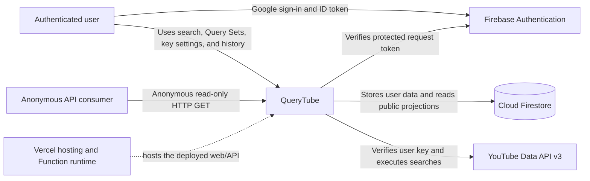
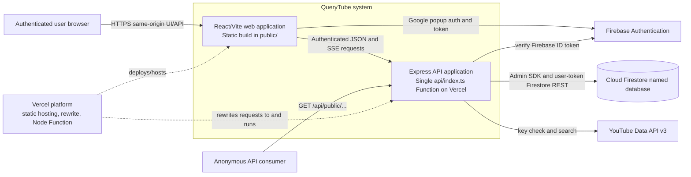
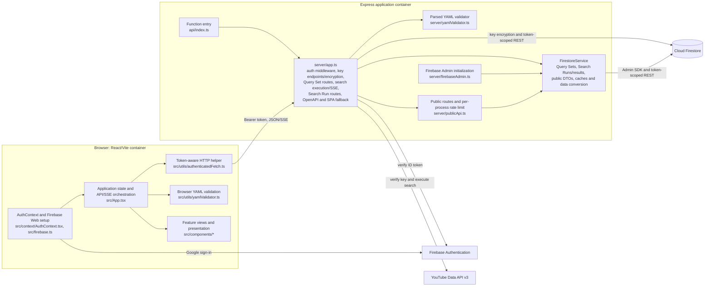

# Current Architecture (AS-IS)

This document describes the implementation on `main` as inspected for this document. It is a statement of current structure and runtime behavior, not a proposed module design. The exact public HTTP contract remains in [OpenAPI](../../openapi/public-api.yaml).

## C4 Level 1 — System Context

Vercel is a deployment platform, not a domain. Firebase Authentication, Firestore, and YouTube Data API are external systems. Anonymous consumers use only the Public Read API; protected operations use Firebase identity.

## C4 Level 2 — Containers

### Web application

The browser runs a React application built by Vite. `vite.config.ts` writes the static output to `public/`; Vercel's Vite configuration hosts it as static output. The browser UI is a same-origin client of the Express API. Firebase Web SDK handles Google popup sign-in and local auth persistence.

`src/App.tsx` is a stateful application coordinator: it stores YAML, selected Query Set, key status, Search Run history, user-scoped data, and tab state; it calls backend routes, starts/aborts searches, parses SSE events, and passes callbacks to view components. There is no URL router in the inspected app. Feature views include `QueriesView`, `HistoryView`, `YamlEditor`, `YamlViewer`, key settings, and the embedded API docs.

### Express API application

`api/index.ts` re-exports the default Express app from `server/app.ts`. On Vercel, `vercel.json` rewrites requests to that Function. The Function bundle includes the OpenAPI YAML and SPA entry file. The Express app also adds a Vercel-mode SPA fallback for non-file frontend paths.

Locally, `server/dev.ts` imports the same Express app, attaches Vite middleware in development or static `public/` serving in production mode, and calls `listen()`. These are two runtime entry paths to the same Express route implementation, not separate backend services.

## C4 Level 3 — Components

The diagram deliberately keeps `server/app.ts` as one component containing multiple domain responsibilities. `FirestoreService` is also one broad component: it handles Query Set and Search Run persistence, public reads/projections, serialization, and process-local maps. The line between a route handler, use case, and persistence operation is not consistently drawn today.

## Cross-cutting current facts

- **Authentication:** `AuthContext` uses Firebase Web Auth. `authenticatedFetch` sends a bearer token and makes one forced-refresh retry after HTTP 401. `requireAuth` verifies it with Firebase Admin and stores the verified UID/token on the Express request.
- **Owner data:** Query Sets, Search Runs, their child records, and integrations live below `users/{uid}`. `firestore.rules` restricts direct client access to the authenticated UID. The backend uses that verified UID for protected route storage calls.
- **Credential storage:** key verification, AES-256-GCM encryption/decryption, integration REST persistence, and a plaintext per-UID in-process cache all live in `server/app.ts`, outside `FirestoreService`.
- **Mixed Firestore access:** `FirestoreService` uses Admin SDK for Query Set/Search Run lists when configured and for public reads; several single-resource and write paths use Firestore REST with the user's ID token. Search Run details and nested results are reconstructed from REST documents for owner reads. This is one shared Firestore database, not separate stores.
- **Search-to-history coupling:** `server/app.ts` creates a Search Run before query execution, calls YouTube, writes each Query Result/video, and updates the summary. Some write helpers catch and log errors, so a successful response or final SSE event is not proof every child document persisted.
- **Publication:** Query Sets use `publicApiEnabled`; Search Runs use their own `visibility`. `server/publicApi.ts` is anonymous and delegates to Admin-backed public projection methods. Its 100 requests/minute/IP state is an in-memory `Map` local to a process instance.
- **API docs:** `openapi/public-api.yaml` is loaded by `server/app.ts`, served as `/openapi.json` and used by Express Swagger UI at `/api-docs/`. The React app has a separate `ApiDocsView` that fetches `/openapi.json`.

No ADR directory or BDD feature files were present. The existing [Vercel migration implementation plan](../vercel-migration-implementation-plan.md) is planning documentation; it is not treated here as proof of runtime behavior or historical rationale. Runtime facts above were checked against the current entrypoints and configuration.

