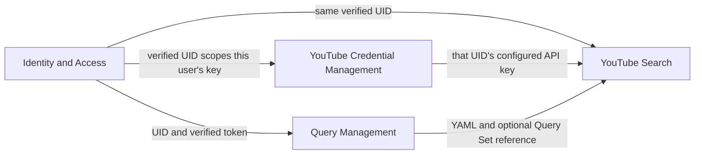
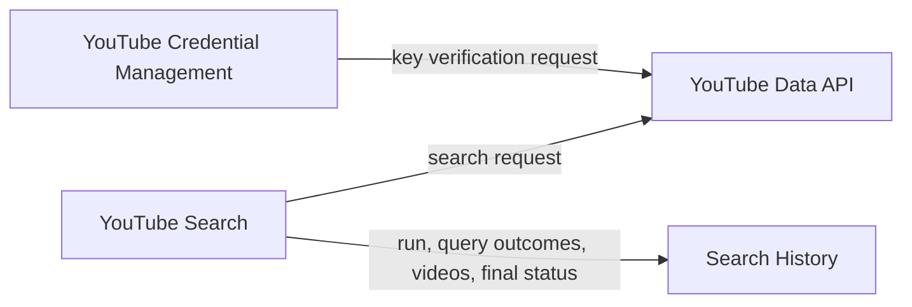
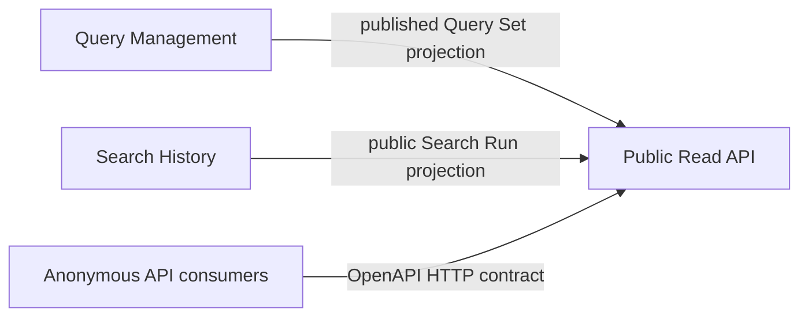

# QueryTube Domain Map

## Modeling approach

A bounded context is a logical responsibility boundary. It does not need to correspond one-to-one with a directory, package, service, C4 Component, container, or deployment. See the current [Domain-to-Code Mapping](../code-view.md) to find where these responsibilities live in source.

This is a logical product map. The current software structure is documented in the [Software View](../software-view.md), with implementation locations in the [Code View](../code-view.md).

Navigate to the [System View](../system-view.md), [Software View](../software-view.md), [Code View](../code-view.md), and [Deployment View](../deployment-view.md).

YouTube Search is the product's core capability. Identity, credentials, saved query definitions, history, and public read access support that capability or make its outputs reusable. These labels describe product responsibilities, not current module quality.

## Bounded contexts

| Context | Classification | Responsibility |
|---|---|---|
| [Identity and Access](contexts/identity-and-access.md) | Generic capability | Establishes the signed-in Firebase identity and scopes protected operations to its UID. |
| [YouTube Credential Management](contexts/youtube-credentials.md) | Supporting | Verifies, protects, and retrieves each user's YouTube Data API key for server-side use. |
| [Query Management](contexts/query-management.md) | Supporting | Defines YAML searches and lets a user save, edit, and publish reusable Query Sets. |
| [YouTube Search](contexts/youtube-search.md) | Core | Validates a search request, executes its queries against YouTube Data API, and returns results or progress. |
| [Search History](contexts/search-history.md) | Supporting | Retains Search Runs, per-query outcomes, videos, status, and owner-controlled run visibility. |
| [Public Read API](contexts/public-read-api.md) | Supporting interface context | Exposes explicitly shared Query Sets and Search Runs to anonymous read-only consumers. |

The Public Read API is a separate consumer-facing context because it has its own anonymous access contract and public projections. Query Management remains the owner of Query Set content and its `publicApiEnabled` setting; Search History remains the owner of Search Run content and its `visibility` setting.

## Logical landscape

### Identity and search inputs

The diagram shows the identity-to-credential relationship at a high level. The key ownership rule is documented in [YouTube Credential Management](contexts/youtube-credentials.md).

### Search execution and YouTube integration

### Public read access

The diagrams show logical dependencies, not separate runtime services. In the current system, most authenticated behavior is implemented in one Express application and shares `FirestoreService`; the configured Firebase project and database vary by runtime configuration.
