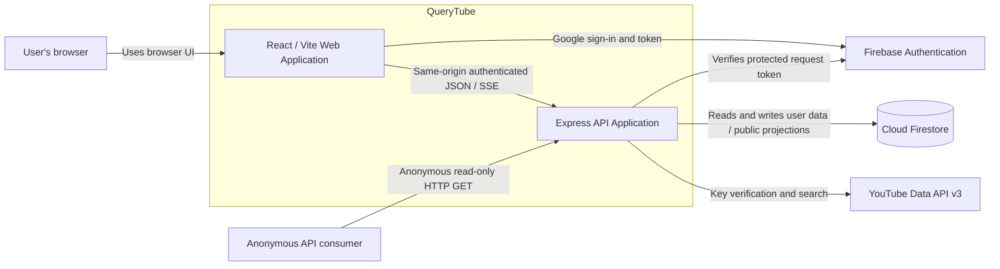
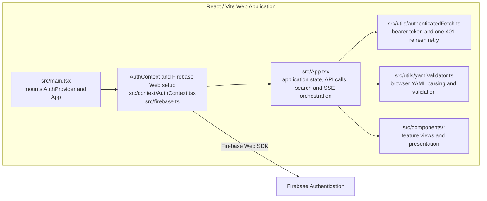
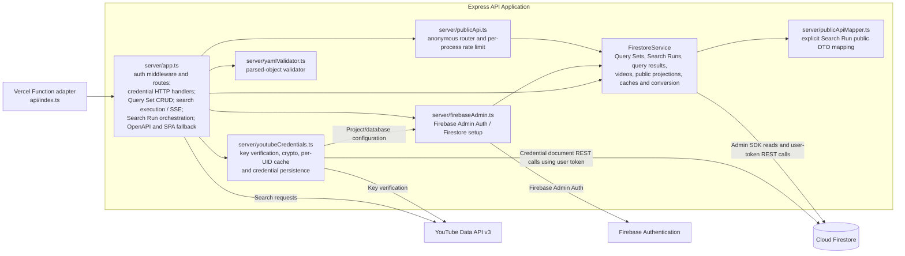

# Software View

This is the C4 software structure of QueryTube as implemented on `main`. For actors and external systems, see the [System View](system-view.md). Logical responsibilities are in the [Domain View](domain-view/README.md), physical source organization in the [Code View](code-view.md), and runtime nodes in the [Deployment View](deployment-view.md).

## Containers

The React/Vite application is the browser UI and client of the HTTP API. The Express application handles authenticated application routes and anonymous public reads. These are the two current software containers; the Vercel Function, local Node process, and Vite static output are deployment details in the [Deployment View](deployment-view.md).

## Components

### React / Vite Web Application

`src/App.tsx` is a stateful coordinator for search, Query Sets, key settings, history, tab state, and API documentation navigation. Feature views are separate React components, while much of the data loading, API request, and SSE lifecycle remains in `App.tsx`. The app uses tab state rather than a URL router.

The Search presentation uses `SearchWorkspace` for independently collapsible Query YAML and Search Result panels. Desktop Show/Hide controls share a horizontal toolbar; a hidden panel leaves no rail, and the other panel takes the full workspace width. Narrow screens retain each panel's horizontal collapse header. At desktop widths the Search shell follows the dynamic viewport with a 720px minimum for short-window page access, and its remaining flex/grid height is distributed to independently scrolling content. Narrow screens retain stacked panels with bounded YAML content and page scrolling. Editor execution/validation actions and viewer exports remain outside long-content scrollers; supplemental notices, schema help, validation feedback, and Execution Monitor are bounded. Collapse hides mounted content and preserves child presentation state without affecting a Search Request; collapse preferences reset when the Search view unmounts. These are browser presentation boundaries, not new domain or runtime containers.

### Express API Application

`api/index.ts` is the Vercel adapter; local startup is described in the Deployment View. `server/app.ts` combines route registration, authentication, HTTP handling, search execution, and Search Run orchestration. It delegates key lookup, configuration, and removal to `server/youtubeCredentials.ts`, which owns verification, encryption/decryption, the per-UID process cache, and user-token Firestore credential access. `FirestoreService` combines Query Set and Search Run persistence, authoritative public reads, data conversion, and process-local caches. Search Run projections use `server/publicApiMapper.ts` and independent DTOs in `src/types/publicApi.ts`; Query Set projections remain in `FirestoreService`. The public router is a separate source module, while publication changes remain in `server/app.ts`.

The public module registers the same three Search Run handlers for `/api/public` and `/api/v1/public`, with shared service/mappers and one per-process IP rate-limit budget. Legacy Query Set definition routes remain in the original router. V1 is preferred for new external Search Run consumers; legacy aliases remain supported without a scheduled removal date. OpenAPI defines the migration/deprecation policy and requires a new major URL version for breaking changes.

These are current implementation components and responsibilities. The logical responsibilities named in the [Domain View](domain-view/README.md) are not all separate components: the current code does not contain distinct `QueryService`, `SearchService`, or `HistoryService` modules.
