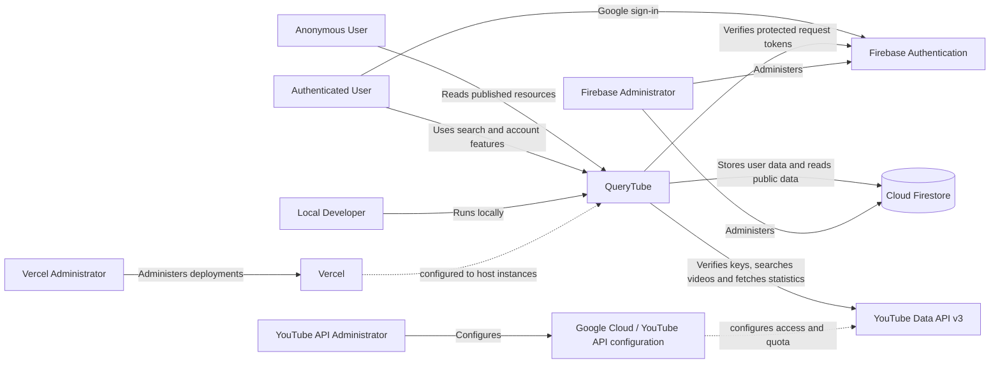

# System View

## System

QueryTube is a web system for defining searches in YAML, running them against YouTube Data API with a user's own API key, retaining Search Runs, and optionally sharing selected Query Sets and runs through an anonymous read-only API.

The internal software structure is in the [Software View](software-view.md), domain responsibilities in the [Domain View](domain-view/README.md), source locations in the [Code View](code-view.md), and runtime topology in the [Deployment View](deployment-view.md).

## Actors

| Actor | Relationship to QueryTube |
|---|---|
| Anonymous User | Reads Query Sets and Search Runs that their owners have made public. |
| Authenticated User | Signs in and manages search definitions, API key settings, searches, and search history. |
| Local Developer | Runs and changes QueryTube in a local development environment. |
| Firebase Administrator | Manages Firebase Authentication and Cloud Firestore configuration and access. |
| YouTube API Administrator | Manages the Google Cloud project, YouTube Data API enablement, credentials, restrictions, and quota. |
| Vercel Administrator | Manages QueryTube deployments and environment configuration on Vercel. |

A person can act in more than one role.

## External systems

| External system | Relationship |
|---|---|
| Firebase Authentication | Provides Google sign-in and Firebase ID tokens; QueryTube verifies protected requests against it. |
| Cloud Firestore | Stores user-owned YouTube credentials, Query Sets, Search Runs, query outcomes, and videos. |
| YouTube Data API v3 | Verifies user-provided keys and supplies search results and video statistics observed during Search Runs. |
| Google Cloud / YouTube API configuration | Lets the YouTube API administrator configure the project, API enablement, key restrictions, and quota used by YouTube Data API. It is administration/configuration context rather than an application runtime request path. |
| Vercel | The repository configures it to host the QueryTube web application and API runtime. The [Deployment View](deployment-view.md) describes that topology and notes what live deployment state cannot be inferred from source. |

## System landscape

This landscape shows system relationships only. It does not describe QueryTube's containers, source modules, or deployment topology.
