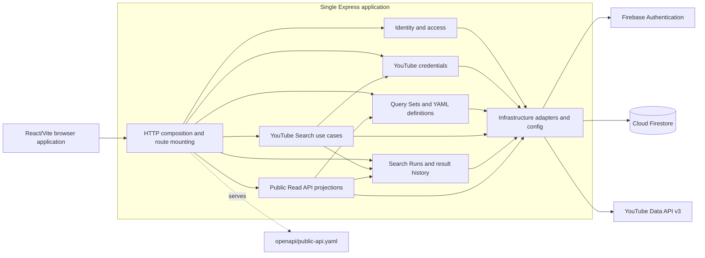

# Target Architecture (TO-BE)

> This document describes a target direction, not the current architecture and not a commitment to perform a large-scale rewrite.

The target is a modular monolith: keep the current browser application, HTTP API, Firestore database, and deployment shape while making the source responsibilities easier to identify and change. Domain alignment does not require every bounded context to become a service, package, or deployable unit.

## Goals

- Bring code ownership closer to the logical boundaries in [Domain Map](../domain-map.md).
- Reduce the number of unrelated behaviors affected by one change.
- Make identity, credential, query, execution, history, and public-projection responsibilities explicit.
- Preserve current route behavior, Firestore paths and document fields, key compatibility, JSON/SSE semantics, and public OpenAPI schemas while moving code.
- Migrate only when a feature change makes extraction useful.
- Avoid introducing abstractions that do not reduce a real current coupling.

## Target C4 Component View

The diagram is a possible organization inside the existing deployment shape. These boxes do not exist as isolated components today.



### Possible source organization

If repeated changes show that extracting code would help, source modules could move gradually toward responsibilities such as:

```text
server/
├── identity/
├── youtubeCredentials/
├── querySets/
├── search/
├── searchRuns/
├── publicApi/
└── infrastructure/
```

This is an example of module names, not a claim that these directories currently exist. `server/app.ts` can remain the Express composition root. `server/firestoreService.ts` need not be mechanically split into one repository per entity; storage adapters should be separated only where mixed access or ownership causes real change risk.

The browser can remain a React SPA. Over time, request/state responsibilities can move out of `src/App.tsx` into feature-level helpers that mirror user capabilities, while presentation components remain view components. A new router or URL model is not required for domain alignment.

## Incremental Domain Alignment

Use this change-driven sequence:

```text
Feature change
     ↓
Inspect the current mixed implementation and its callers
     ↓
Make the smallest behavior-preserving change in place
     ↓
Extract the responsibility if that makes the boundary clearer or reduces repeated risk
     ↓
Update the code map and contract notes
```

Suggested guardrails:

1. Preserve the existing HTTP routes and OpenAPI shapes while moving handlers or DTO mapping.
2. Keep Search Run creation/results/status behavior explicit at the Search-to-History boundary; do not let storage writes disappear inside a generic helper.
3. Keep Firestore document paths and access mode explicit. Any change from user-token REST to Admin SDK, or vice versa, affects authorization semantics and needs its own review.
4. Keep owner identity at protected route boundaries and keep anonymous visibility checks in the Public Read API path.
5. Align YAML validation behavior between browser and server only when the supported language change is understood; document and test the compatibility contract rather than silently changing accepted inputs.
6. Move credential encryption and persistence as one bounded responsibility only when existing payload compatibility and failure behavior are preserved.

Do not begin with a big-bang rewrite. A feature can remain in a mixed file until its next change justifies a narrow extraction. If modular boundaries stop helping, retain the current structure rather than adding indirection for its own sake.

## What remains one deployment

The direction keeps one Vite web application, one Express application/Function, and the existing Firebase/YouTube external systems. Domain boundaries clarify source ownership and contracts; they do not imply microservices, separate databases, or a deployment split.

