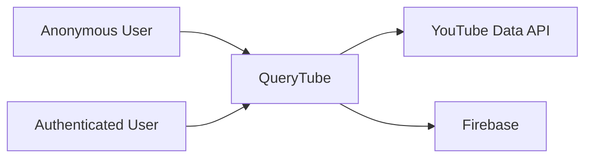
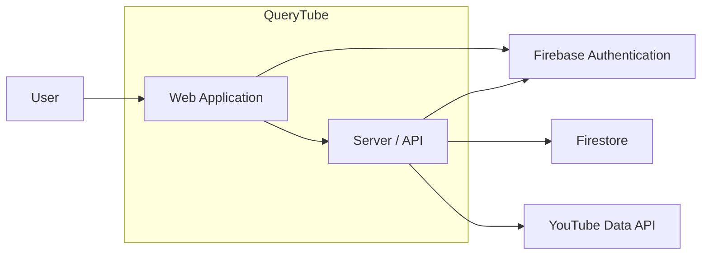

# QueryTube C4 Model

## 1. Purpose

This document describes QueryTube using the C4 model:

```text
System Context
→ Container
→ Component
```

DDD and domain boundaries are documented separately.

---

## 2. Level 1 — System Context

QueryTube is the software system of interest.



External systems:

- **YouTube Data API** — provides search data.
- **Firebase** — provides authentication and persistence.

---

## 3. Level 2 — Container

Conceptually, QueryTube contains:

```text
QueryTube
├── Web Application
└── Server / API
```



### Web Application

Responsible for:

- user interface;
- query and result views;
- authentication UI;
- API documentation UI.

### Server / API

Responsible for:

- application APIs;
- YouTube search execution;
- persistence;
- server-side authorization;
- public APIs;
- server-side secrets.

---

## 4. Level 3 — Component

The Server / API can be viewed conceptually as:

```text
Server / API
├── API / Route Layer
├── Authentication & Authorization
├── Query Service
├── Search Execution Service
├── Result Service
├── Public API
├── Persistence Layer
└── YouTube API Client
```

These are architectural responsibilities and do not imply that the current source code is already separated exactly this way.

---

## 5. C4 and DDD

C4 and DDD describe different views.

```text
DDD
→ business concepts and boundaries

C4
→ software structure

Domain-to-Code Mapping
→ how the two relate in the implementation
```

A Domain or Bounded Context does not need to map 1:1 to a C4 Container or source directory.