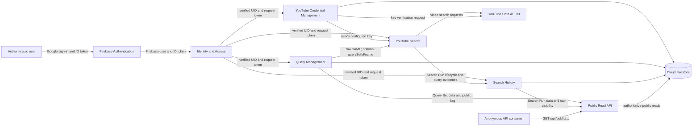

# QueryTube Context Map

This map describes information and responsibility flowing between the logical contexts. It is not a source-module diagram: the current implementation places several of these responsibilities in the same Express application and in `FirestoreService`.

## Relationships

| Upstream | Downstream | Interaction | Information / contract | Current synchronization |
|---|---|---|---|---|
| Firebase Authentication | Identity and Access | Identity provider | Google sign-in session, Firebase user, ID token, UID | Browser popup and Firebase auth observer; server verifies each protected request token with Firebase Admin. |
| Identity and Access | YouTube Credential Management | Request identity | Verified UID and the ID token used for user-scoped Firestore REST access | Synchronous HTTP request. |
| Identity and Access | Query Management | Request identity | Verified UID and request ID token | Synchronous authenticated Express request. |
| Identity and Access | YouTube Search | Request identity | Verified UID and request ID token | Synchronous authenticated Express request; search may then stream SSE progress. |
| Identity and Access | Search History | Request identity | Verified UID and request ID token | Synchronous authenticated Express request. |
| YouTube Credential Management | YouTube Search | Required search input | Decrypted API key belonging to the authenticated UID | Same-process lookup; warm instances may return a per-UID memory cache before Firestore. |
| Query Management | YouTube Search | Optional source relationship | Raw YAML plus optional `querySetId` and `querySetName` | The client sends a search request. The server accepts raw YAML independently of a saved Query Set; it records the optional association supplied in the request. |
| YouTube Search | Search History | Execution recording | Initial Search Run, one result record per YAML query, videos, and final summary/status | Search handler awaits run creation, schedules result writes, then awaits them and attempts a summary update before returning/completing SSE. Some persistence helpers log and absorb failures. |
| Query Management | Public Read API | Public projection | Query Set data gated by `publicApiEnabled`; list summaries omit raw YAML, detail includes it | Public handler synchronously reads Firestore through Admin SDK and constructs public DTOs. |
| Search History | Public Read API | Public projection | Search Run summary/details gated by the run's own `visibility` | Public handler synchronously reads Firestore through Admin SDK. A run's visibility is independent of Query Set publication. |
| YouTube Credential Management | YouTube Data API v3 | Credential verification | User-supplied API key in a categories request | Synchronous outbound HTTP request with a 10-second timeout. |
| YouTube Search | YouTube Data API v3 | Search execution | Search query, result count, order, safety and optional locale/date filters | Synchronous outbound HTTP requests, up to three query workers at once. |
| Public Read API | Anonymous API consumers | Published interface | Read-only JSON projections described by OpenAPI | Synchronous HTTP GET; router applies an in-memory per-IP rate limit. |

## Boundary notes

- The Firebase UID is the owner key used in authenticated routes and Firestore paths such as `users/{uid}/querySets` and `users/{uid}/searchRuns`. `requireAuth` obtains it from a verified Firebase ID token. The anonymous Public Read API instead accepts a `userId` path parameter and must apply the publication rules before returning data.
- Firestore is shared infrastructure, not a domain. It stores YouTube credentials, Query Sets, Search Runs, query results, and videos. The current service uses both Firebase Admin SDK reads and Firestore REST calls with a user's ID token; see [Current Architecture](architecture/current.md).
- Public API is an HTTP boundary and published contract, not a separate owner of Query Set or Search Run facts. Its implementation currently reads the shared store directly and maps stored models to public projections.
- No formal DDD context-map pattern is assigned to the internal relationships: they are same-process calls and shared persistence today. The OpenAPI YAML is a published consumer contract, but it does not make the backend a separate service.

