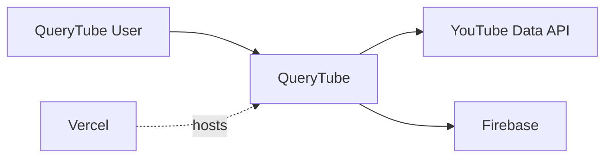

# QueryTube System Overview

## 1. Purpose

This document describes:

- the systems around QueryTube;
- the actors who operate them;
- where QueryTube is deployed.

---

## 2. System Landscape

QueryTube interacts with the following systems:

- **YouTube Data API** — provides YouTube search data.
- **Firebase**
  - Authentication — user identity and login.
  - Firestore — application data storage.
- **Vercel** — hosts deployed QueryTube instances.
- **Google Cloud** — manages YouTube API configuration and credentials.



---

## 3. Actors

### QueryTube Users

- **Anonymous User** — uses public features without login.
- **Authenticated User** — manages queries, searches, results, and other owned resources.

### Development and Operations

- **Local Developer** — runs and develops QueryTube locally.
- **Firebase Administrator** — manages Firebase Authentication and Firestore.
- **YouTube API Administrator** — manages API credentials and quota.
- **Vercel Administrator** — manages deployments and environment configuration.

A single person may have multiple roles.

---

## 4. Deployment

QueryTube is one software system with multiple deployment environments.

### Local Development

```text
Developer Computer
└── QueryTube
      ├── Firebase
      └── YouTube Data API
```

### Production

```text
Vercel
└── QueryTube
      ├── Firebase
      └── YouTube Data API
```

### Preview

Vercel may also host temporary preview deployments.

```text
QueryTube
├── Local
├── Preview
└── Production
```

These are different deployments of the same QueryTube software system.